# TechTrack Object Detection: Case Analysis

## System Context

TechTrack is a real-time object detection system designed for logistics and warehouse safety monitoring. It processes camera feeds and detects 20 different object classes, ranging from safety-critical targets such as people, forklifts, fire, smoke, helmets, and safety vests, to environmental objects like cardboard boxes, traffic cones, and wood pallets. The system's output serves two primary consumers: human operators monitoring a dashboard and automated alert pipelines that trigger warnings when safety violations occur (for example, a person walking near a forklift without wearing a helmet).

This deployment context creates a clear asymmetry in error costs. **Missing a real object (false negative) is far more dangerous than a false alarm (false positive).** Failing to detect a person in a forklift's path or missing an active fire poses a genuine safety risk, while a false alarm typically results in a few seconds of human review. This asymmetry shapes every design decision in this analysis. When trade-offs arise, we consistently prioritize recall (detecting more true objects) over precision (reducing false alarms), and we evaluate robustness through the lens of real-world warehouse conditions such as motion blur, dirty lenses, and fluctuating lighting.

All experiments use YOLOv4-tiny models at 416x416 resolution on a 20-class logistics dataset of 9,525 images. Unless otherwise stated, metrics are macro-averaged precision, recall, and F1 across all classes, using an IoU threshold of 0.5 to determine whether a predicted bounding box counts as correct. Macro-averaging is appropriate here because rare but safety-critical classes (e.g., fire or helmet) should carry equal weight in evaluation rather than being dominated by more common objects. 

The report is structured as a sequence of connected design decisions, where each task builds on the previous one and informs the next.

---

## Task 1: Model Selection

*Which of the two available model checkpoints should TechTrack deploy, and what performance characteristics come with that choice?*

### Methodology

Model 1 and Model 2 share the same architecture (YOLOv4-tiny, 416x416) but differ in their trained weights. To keep the comparison fair, both models were evaluated on the full 9,525-image dataset under identical conditions: a confidence threshold of 0.5 and an NMS IoU threshold of 0.4. Predictions for each model were cached to disk so that evaluation could be repeated without re-running inference. 

For matching, each predicted bounding box was greedily assigned to the highest IoU ground truth box of the same class. A prediction was counted as a true positive only if the IoU was at least 0.5. All metrics reported below are macro-averaged across the 20 classes.

I deliberately evaluated on the full dataset rather than the 6,000-image sample used in later tasks. Model selection is a high-stakes decision that affects every downstream experiment and deployment outcome. Using all available data reduces sampling variance in macro-averaged metrics and ensures that recall estimates are stable and representative.

### Results

**Table 1: Overall Model Comparison (macro-averaged over 20 classes)**

| Metric     | Model 1 | Model 2 | Difference (M2 - M1) |
|------------|---------|---------|----------------------|
| Precision  | 0.8187  | 0.8217  | +0.003               |
| Recall     | 0.4555  | 0.5138  | +0.058               |
| F1         | 0.5598  | 0.6086  | +0.049               |

Table 1 shows that Model 2 outperforms Model 1 by 4.9 F1 points overall. Precision is nearly identical (approximately 0.82 for both models), meaning that when either model produces a detection, it is usually correct. The performance gap comes almost entirely from recall: Model 2 achieves 5.8 percentage points higher recall than Model 1.

From a deployment perspective, this recall difference is substantial. A 5.8% increase in recall means that Model 2 would miss significantly fewer real objects across warehouse scenes. Given that missed detections are the dominant safety risk in this system, this improvement directly translates to fewer undetected hazards in practice.

**Table 2: Classes where Model 2 gains the most over Model 1**

| Class ID | Class Name  | F1 (M1) | F1 (M2) | Gain   |
|----------|-------------|---------|---------|--------|
| 4        | forklift    | 0.690   | 0.807   | +0.117 |
| 8        | ladder      | 0.324   | 0.433   | +0.110 |
| 0        | barcode     | 0.665   | 0.751   | +0.086 |
| 10       | person      | 0.539   | 0.613   | +0.074 |
| 6        | gloves      | 0.677   | 0.751   | +0.074 |

> The full 20-class comparison can be seen in `Figure 1` and the supporting notebook (`task1.ipynb`). 

Table 2 reveals an even more important pattern: Model 2 improves performance on **every single class**. No class regresses. The largest gains show up on safety-critical classes: forklift jumps by 11.7 F1 points and person by 7.4 points. In a system where failing to detect a person near heavy machinery carries serious consequences, these gains are operationally meaningful.

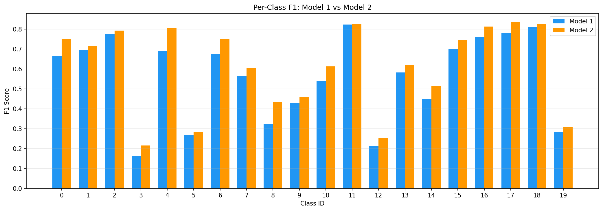
*Figure 1 (`analysis/figures/model_comparison_f1.png`): A grouped bar chart comparing per-class F1 for both models. Model 2's bars are consistently taller, with the widest margins on the safety-related classes.*

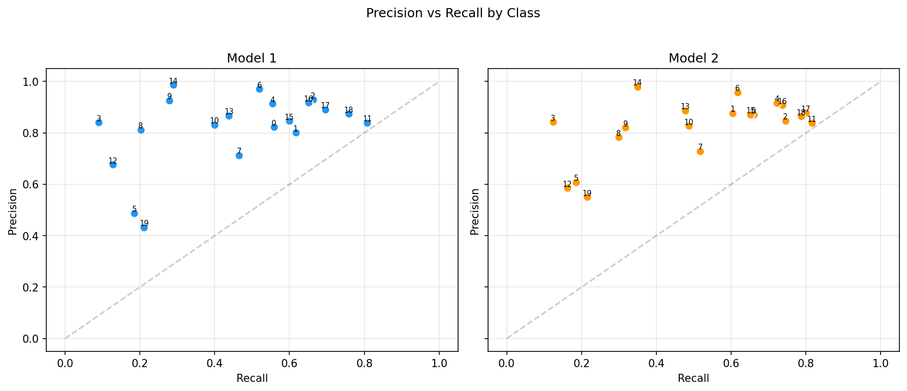
*Figure 2 (`analysis/figures/model_pr_scatter.png`): A precision-recall scatter plot by class for each model. Model 2 shifts most class points to the right (higher recall) while keeping them at roughly the same height (similar precision).*

### Limitations

This comparison uses a single NMS threshold (0.4) for both models. It is possible that each model has its own optimal NMS threshold, and Model 1 might close the gap under different post-processing configuration. However, since Task 3 explicitly tunes NMS for the selected model, the final deployment configuration will be optimized accordingly.

Additionally, this evaluation uses greedy matching rather than COCO-style mAP with multiple IoU thresholds. While the absolute F1 values may differ from standardized benchmarks, the relative comparison between the two models remains valid because both were evaluated under identical conditions.

### Design Decision

**Model 2 is the clear choice for deployment.** It delivers better performance across all 20 classes while maintaining nearly identical precision. Because Model 2 improves recall without sacrificing precision, there is no trade-off to justify. It is superior under TechTrack's safety-oriented objective.

Given that false negatives carry higher operational risk than false positives in this system, Model 2's recall advantage decisively outweighs any marginal metric differences elsewhere. All subsequent analysis and tuning are therefore conducted using Model 2.

---

## Task 2: Dataset Sampling Strategy

*How can we construct a representative subset of the dataset that keeps experiments efficient without introducing bias into downstream results?*

### Methodology

The full dataset contains 9,525 images. While a single inference pass over all images is manageable (as done in Task 1), the augmentation experiments in Task 4 require 13 separate inference passes, and the HNM analysis in Task 5 requires computing per-image loss components. Running all experiments on the full dataset would significantly increase total runtime and slow iteration. To balance computational efficiency with statistical reliability, I selected a subset of 6,000 images (approximately 63% of the dataset).

The sampling procedure has three parts:
1. **Uniform random sampling with a fixed seed (seed = 42):**  
   6,000 images were drawn uniformly at random to preserve the overall data distribution while ensuring full reproducibility.

2. **Class coverage verification:**  
   After sampling, I verified that all 20 object classes were represented in the subset. The sampling script included a fallback mechanism to insert additional images if any class were missing, though this safeguard was not triggered.

3. **Saved subset list:**  
   The final list of selected image paths was saved to `analysis/sample_images.txt`. All subsequent tasks (3-5) operate on this identical subset to ensure consistency across experiments.

### Justification

This strategy satisfies three key design requirements. 

First, 6,000 images comfortably exceeds the 5,000-image minimum, providing sufficient statistical power for macro-averaged precision and recall estimates. At this scale, sampling variance is unlikely to meaningfully alter model rankings or threshold comparisons.

Second, uniform random sampling preserves the original class distribution on average. Combined with explicit class coverage verification, this ensures that no category, especially safety-critical ones, drops out of evaluation.

Third, reproducibility is guaranteed through the fixed random seed and saved subset list. Every downstream experiment operates on exactly the same images, eliminating inconsistencies that could arise from shifting data splits.

### Limitations and Alternatives

A purely random sample does not guarantee balanced per-class representation. Rare classes may still appear with relatively low frequency, which can increase metric variance for those categories. An alternative would be stratified sampling weighted by inverse class frequency, which would guarantee more balanced representation and more stable metrics for rare classes like fire (class 3) or freight container (class 5). I opted for the simpler approach after confirming full coverage, but stratified sampling would be preferable for datasets with more extreme class imbalance. Similarly, with more compute resources, running all tasks on the full dataset would eliminate sampling variance entirely.

---

## Task 3: NMS Threshold Design

*What NMS IoU threshold gives the best detection quality for our chosen model, and what do we gain or lose at each setting?*

### Methodology

Non-Maximum Suppression (NMS) is the post-processing step that removes duplicate overlapping detections. The IoU threshold controls how aggressively it filters: a low threshold removes more boxes (fewer duplicates but risk of suppressing valid detections), while a high threshold keeps more boxes (better recall but more duplicates slip through).

To isolate the effect of the NMS threshold from the model's forward pass, I cached all raw (pre-NMS) detections for the 6,000 sample images. Model 2's `predict()` and `post_process()` stages were executed once, then for each NMS threshold in {0.1, 0.2, ..., 0.9}, the cached detections were passed through `NMS.filter()` and evaluated. This way, any differences in performance are purely due to the threshold setting, not randomness in inference. The confidence threshold stayed at 0.5 throughout.

This experiment builds directly on earlier decisions: it uses Model 2 (selected in Task 1) and the reproducible subset defined in Task 2.

### Results

**Table 3: NMS Threshold Sweep (Model 2, 6,000-image sample)**

| NMS Threshold | Precision | Recall | F1     | True Positives | False Positives |
|---------------|-----------|--------|--------|----------------|-----------------|
| 0.1           | 0.8307    | 0.4967 | 0.5974 | 9,757          | 2,366           |
| 0.2           | 0.8259    | 0.5072 | 0.6047 | 10,195         | 2,542           |
| 0.3           | 0.8251    | 0.5151 | 0.6113 | 10,436         | 2,612           |
| 0.4           | 0.8238    | 0.5219 | 0.6169 | 10,606         | 2,675           |
| **0.5**       | **0.8204**| **0.5267** | **0.6194** | **10,729** | **2,779**   |
| 0.6           | 0.8028    | 0.5294 | 0.6157 | 10,828         | 3,008           |
| 0.7           | 0.7565    | 0.5327 | 0.6007 | 10,903         | 3,721           |
| 0.8           | 0.6487    | 0.5354 | 0.5552 | 10,975         | 6,008           |
| 0.9           | 0.5141    | 0.5378 | 0.4836 | 11,017         | 10,899          |

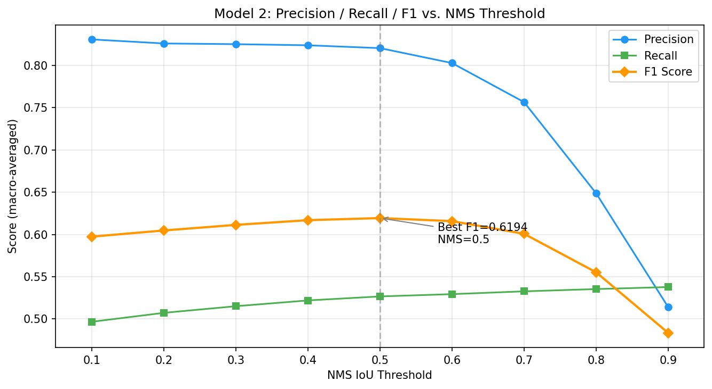
*Figure 3 (`analysis/figures/nms_sweep.png`): Precision, recall, and F1 plotted across NMS thresholds, with the peak F1 annotated. Look for the inflection point around 0.5-0.6 where precision starts dropping steeply while recall gains flatten out.*

Table 3 shows the classic NMS trade-off. As the threshold increases from 0.1 to 0.9, recall goes up steadily (0.497 to 0.538) because fewer valid detections get suppressed. However, precision decreases sharply past 0.5 (from 0.820 all the way down to 0.514) because duplicate boxes start surviving the filter. 

F1 peaks at **0.6194 at NMS = 0.5**, slightly outperforming the default 0.4 (F1 = 0.6169). Importantly, the performance curve seen in Figure 3 is relatively flat between 0.4 and 0.6 before precision begins collapsing. This means there is a small window between 0.4 and 0.6 where recall can improve without precision falling off a cliff.

To understand the impact at the per-class level, I compared the two thresholds side by side:

**Table 4: Per-class impact of shifting from NMS=0.4 to NMS=0.5 (selected classes)**

| Class ID | Class Name  | F1 at 0.4 | F1 at 0.5 | Change  |
|----------|-------------|-----------|-----------|---------|
| 13       | safety vest | 0.631     | 0.675     | +0.043  |
| 10       | person      | 0.615     | 0.621     | +0.006  |
| 8        | ladder      | 0.483     | 0.487     | +0.004  |
| 11       | qr code     | 0.888     | 0.882     | -0.006  |
| 17       | truck       | 0.826     | 0.823     | -0.003  |

Table 4 shows that the largest gain occurs for safety vest (+4.3 points). This makes intuitive sense: safety vests frequently overlap spatially with the person wearing them, so a slightly more permissive NMS avoids killing the vest detection when its box overlaps the person box. The small losses on classes like qr code (-0.6 points) come from cases where the loosened threshold lets through a few extra duplicate detections on high-contrast targets.

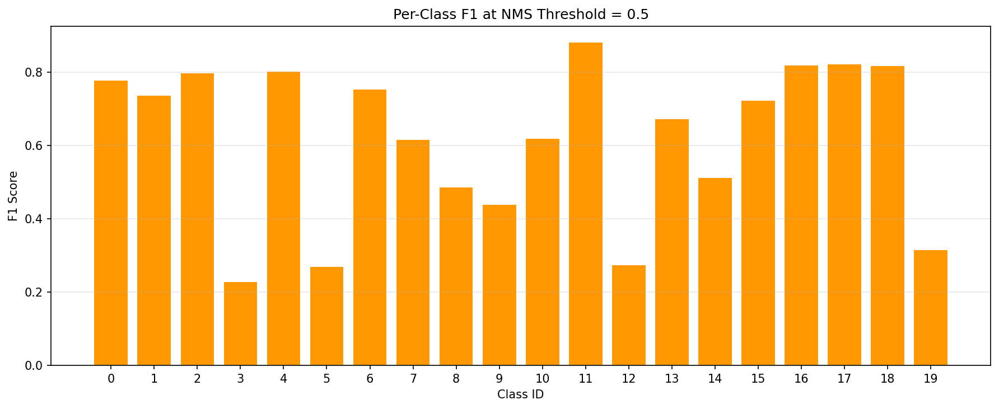
*Figure 4 (`analysis/figures/nms_best_per_class.png`): Per-class F1 at the chosen threshold of 0.5, showing the wide spread in class-level performance (from about 0.23 for fire up to 0.88 for qr code).*

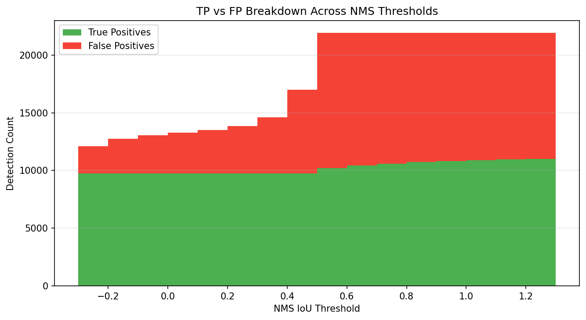
*Figure 5 (`analysis/figures/nms_detection_counts.png`): Stacked true positive and false positive counts across thresholds. Notice how the false positive count explodes beyond 0.6.*

### Error Analysis

To get a qualitative sense of what goes wrong at the chosen threshold, I sampled a random subset of images and categorized the errors. The sample contained 52 false positives and 236 false negatives. The most common class for both FP and FN was wood pallet (class 19): 17 false positives and 101 false negatives. This is not surprising since wood pallets are frequently stacked and overlapping in warehouse scenes, making them inherently tricky for both detection and NMS. The high total false negative count across the dataset (12,858) reinforces what we have seen throughout this analysis: the system's main weakness is missed detections, not false alarms.

### Alternative Considerations

Given TechTrack’s safety-oriented objective, NMS = 0.6 is a plausible alternative. That setting recovers 99 additional true positives relative to 0.5, at the cost of 229 additional false positives and a 0.4-point drop in F1. If the alert pipeline can tolerate more false alarms, this would be a defensible choice. I went with 0.5 as the best general-purpose setting, but it is worth noting that per-class or adaptive NMS thresholds could push things further. For instance, a more permissive threshold specifically for safety vest and person (where spatial overlap is inherent to the object) could help without flooding other classes with duplicates.

### Design Decision

**NMS threshold = 0.5** is the recommended setting for deployment. 
This setting lies within the stable region of the precision-recall curve, achieves the highest overall F1, and improves recall relative to the default 0.4 without introducing an excessive number of duplicate detections. It represents a balanced operating point that aligns with TechTrack’s safety priorities while maintaining manageable false positive rates.

All subsequent augmentation and HNM experiments use NMS = 0.5.

---

## Task 4: Augmentation Impact

*How robust is our model to visual perturbations it might actually encounter in a real warehouse, and which augmentations should go into future training pipelines?*

### Methodology

I applied three types of augmentation to all 6,000 sample images at various intensities. For each augmented version of the dataset, Model 2 (selected in Task 1) was run with NMS threshold 0.5 (chosen in Task 3) and evaluated against the original ground truth labels. For vertical flip, bounding boxes were mirrored to ensure fair evaluation. The confidence threshold remained fixed at 0.5 throughout.

Each augmentation maps to something that could realistically happen in deployment:

- **Gaussian Blur** (kernel sizes 3, 5, 9, 15, 21): simulates motion blur, dirty camera lenses, or foggy conditions.
- **Vertical Flip**: tests whether the model can handle objects that appear upside down, which would matter if cameras were mounted at unusual angles.
- **Brightness Adjustment** (factors 0.25 to 2.00, where 1.0 is the original): simulates different lighting conditions, from very dim warehouse corners to direct sunlight.

### Results

**Table 5: Augmentation Impact Summary**

| Augmentation   | Precision | Recall | F1     | F1 Drop vs Baseline |
|----------------|-----------|--------|--------|----------------------|
| Baseline       | 0.8204    | 0.5267 | 0.6194 | (none)               |
| Blur k=3       | 0.8535    | 0.4814 | 0.5907 | -0.029               |
| Blur k=5       | 0.8626    | 0.4369 | 0.5527 | -0.067               |
| Blur k=9       | 0.8717    | 0.3488 | 0.4638 | -0.156               |
| Blur k=15      | 0.8814    | 0.2765 | 0.3834 | -0.236               |
| Blur k=21      | 0.8453    | 0.2192 | 0.3126 | -0.307               |
| Vertical Flip  | 0.6665    | 0.2540 | 0.3091 | -0.310               |
| Bright 0.25    | 0.8413    | 0.4463 | 0.5523 | -0.067               |
| Bright 0.50    | 0.8335    | 0.5092 | 0.6070 | -0.012               |
| Bright 0.75    | 0.8223    | 0.5264 | 0.6193 | -0.000               |
| Bright 1.25    | 0.8191    | 0.5188 | 0.6127 | -0.007               |
| Bright 1.50    | 0.8193    | 0.5022 | 0.5992 | -0.020               |
| Bright 2.00    | 0.8094    | 0.4337 | 0.5364 | -0.083               |

Table 5 tells a clear story: vertical flip and heavy blur are equally devastating (both drop F1 by about 31 points), while brightness changes are far more tolerable.

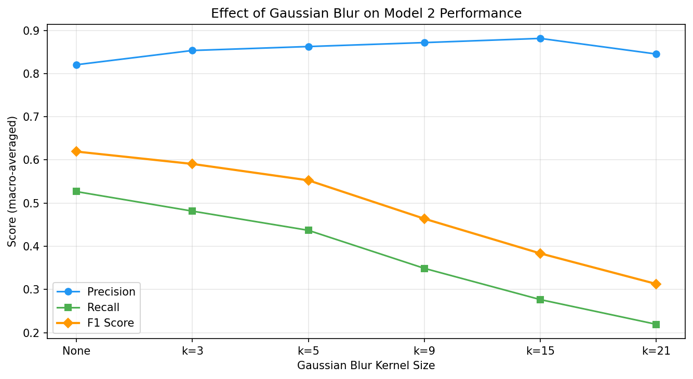
*Figure 6 (`analysis/figures/aug_blur_impact.png`): Precision, recall, and F1 across blur kernel sizes. Watch for the steady recall decline and the counterintuitive precision increase.*

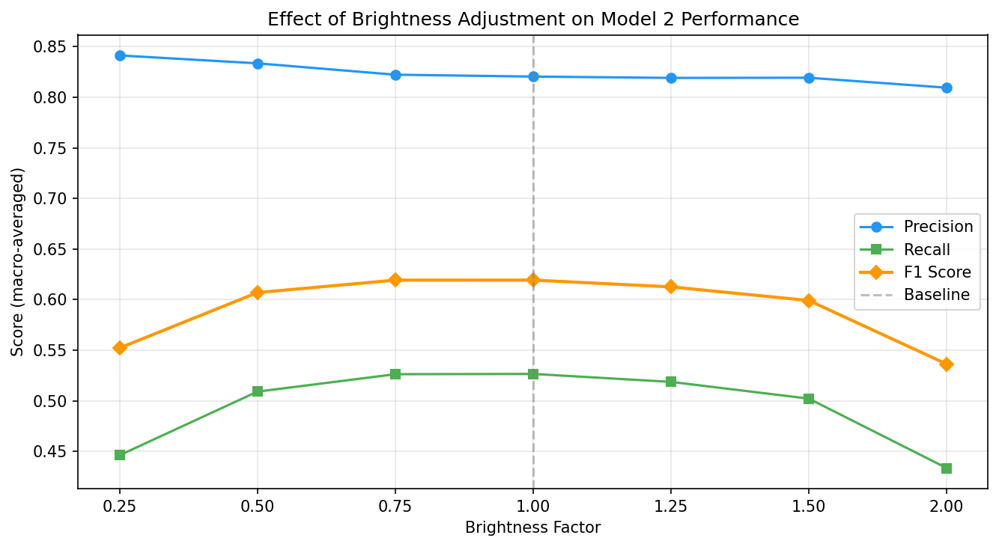
*Figure 7 (`analysis/figures/aug_brightness_impact.png`): Precision, recall, and F1 across brightness factors, forming an asymmetric curve centered near factor 1.0.*

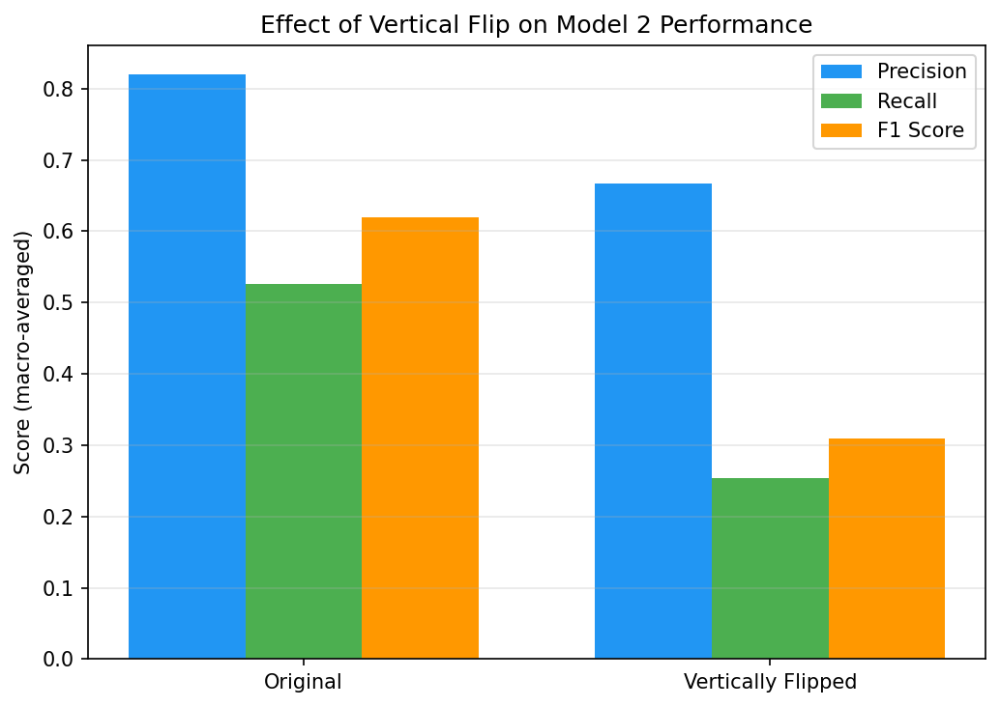
*Figure 8 (`analysis/figures/aug_vflip_impact.png`): Baseline versus vertical flip side by side. The drop in both precision and recall is dramatic.*

### Analysis

**Gaussian Blur** hurts the model primarily by decreasing recall, and the effect is monotonic: as blur increases, detections decrease. There is a counterintuitive twist though. Precision actually *goes up* under blur (from 0.820 to 0.881 at k=15). What is happening is that blur makes the model more conservative. It only fires on the most visually obvious objects, so false positives drop, but it also misses everything subtle. This pattern holds up to k=15, but at k=21 precision drops back to 0.845, suggesting that at extreme blur levels even the model's most confident detections become unreliable. By k=15 the model is missing over 72% of all objects (recall = 0.277), which would be completely unacceptable for a safety system. The classes hit hardest are the ones with fine-grained visual features that blur destroys:

**Table 6a: Classes most affected by Gaussian Blur (k=15)**

| Class       | Baseline F1 | Blur k=15 F1 | Drop   |
|-------------|-------------|--------------|--------|
| truck       | 0.823       | 0.342        | -0.481 |
| helmet      | 0.617       | 0.149        | -0.469 |
| ladder      | 0.487       | 0.073        | -0.414 |
| safety vest | 0.675       | 0.299        | -0.375 |
| person      | 0.621       | 0.260        | -0.361 |

Table 6a shows that blur disproportionately impacts classes whose detection depends on texture and shape detail. Truck markings, the curved shape of helmets, the thin rungs of ladders: these all get smeared away by heavy blurring.

**Vertical Flip** is the single most damaging augmentation (F1 drops from 0.619 to 0.309), and it hurts both precision and recall at the same time. This is entirely expected. The model was trained on upright images, and logistics objects have very strong orientation priors. Forklifts drive on the ground. Helmets sit on top of heads. Traffic cones point upward. Flip all of that upside down and the model barely recognizes anything.

**Table 6b: Classes most affected by Vertical Flip**

| Class        | Baseline F1 | Flipped F1 | Drop   |
|--------------|-------------|------------|--------|
| forklift     | 0.804       | 0.067      | -0.738 |
| gloves       | 0.755       | 0.154      | -0.601 |
| helmet       | 0.617       | 0.023      | -0.594 |
| traffic cone | 0.724       | 0.146      | -0.578 |
| car          | 0.738       | 0.176      | -0.562 |

Table 6b confirms the model has essentially zero orientation invariance. Forklift detection decreases from 0.804 to 0.067, meaning the model detects basically nothing when the image is flipped.

**Brightness Adjustment** is where the model holds up best. Mild adjustments barely register: making the image 25% darker (factor 0.75) causes virtually no degradation at all (F1 drops by 0.000), and making it 25% brighter (factor 1.25) costs just 0.7 F1 points. Only at the extremes does it start to matter. Severe darkening (factor 0.25) drops F1 by 6.7 points, and severe brightening (factor 2.0) drops it by 8.3 points. The model appears noticeably more sensitive to overexposure than underexposure, likely because excessive brightness reduces edge contrast needed for drawing bounding boxes.

Among individual classes, brightness changes at factor 0.50 most affected smoke (F1 drops 5.9 points) and barcode (drops 3.9 points), both of which depend on contrast patterns that dimming suppresses.

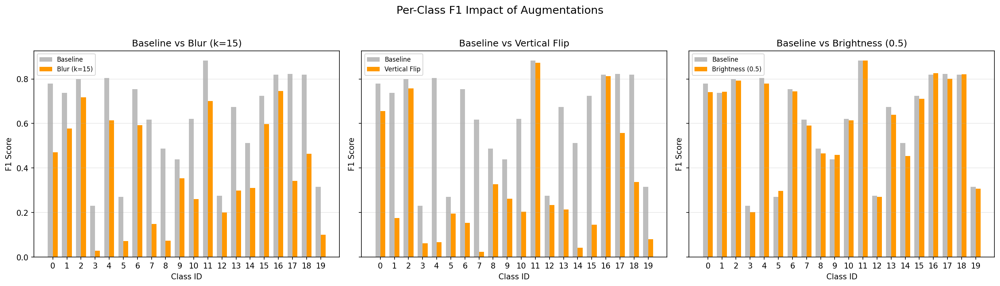
*Figure 9 (`analysis/figures/aug_per_class_impact.png`): Per-class F1 under representative augmentations, showing which specific classes are most fragile to each perturbation type.*

### Design Implications

For **training**, these results suggest including mild Gaussian blur (k=3 to k=5) and moderate brightness (factor 0.75 to 1.25) as augmentations. These are realistic perturbations that the model should learn to handle, and the data shows they cause modest but real degradation that training augmentation could address. Vertical flip should **not** be used as a training augmentation here. Logistics objects always appear upright in practice, and training the model to detect inverted objects would waste capacity on a scenario that does not occur in the real world.

For **deployment**, these results set practical boundaries. If TechTrack is deployed in a warehouse with poor lighting (effective brightness below factor 0.5) or cameras that produce blurry images (equivalent to kernel size 9 or higher), the model's recall will decrease substantially. Helmet detection, for instance, drops from F1=0.617 to 0.149 under heavy blur, which means a dirty or out-of-focus camera could render PPE monitoring essentially useless. In those conditions, the fix should come from better hardware or image preprocessing, not just model retraining.

---

## Task 5: HNM Sampling Strategy

*How do the lambda hyperparameters in Hard Negative Mining affect which images get selected for retraining, and what does this tell us about where the model is actually struggling?*

### Methodology

Hard Negative Mining (HNM) is a training technique that identifies the images a model has the hardest time with, so those images can be emphasized during retraining. The idea is straightforward: compute a loss for each image, rank them from highest to lowest loss, and sample the top ones as "hard negatives."

In TechTrack, the per-image loss combines four components, each controlled by a lambda weight:

```
total_loss = lambda_coord * L_loc + lambda_obj * L_conf_obj + lambda_noobj * L_conf_noobj + lambda_cls * L_class
```

- `L_loc` measures how far off the predicted boxes are from ground truth 
- `L_conf_obj` measures how many objects the model failed to detect
- `L_conf_noobj` measures false confidence on background regions
- `L_class` measures how often the model gets the class label wrong. 

By tuning the lambda weights, you can steer the mining process toward different types of errors. For example, increasing `lambda_coord` should prioritize poorly localized boxes, while increasing `lambda_cls` should emphasize misclassifications.

To avoid re-running inference for each configuration, I computed all four raw loss components once (with all lambdas set to 1.0) on the 6,000 sample images using Model 2. Then I reweighted the components analytically under six different lambda configurations and selected the top 100 images by total loss for each setting.

One important detail: the HNM system receives raw model outputs before post-processing and NMS. This is standard practice since HNM operates at the training pipeline level, but it affects how the loss statistics should be interpreted.

**Table 7: Lambda configurations tested**

| Config               | lambda_coord | lambda_obj | lambda_noobj | lambda_cls | Intent                          |
|----------------------|--------------|------------|--------------|------------|---------------------------------|
| balanced             | 0.5          | 0.5        | 0.5          | 0.5        | Default equal weighting         |
| localization_heavy   | 2.0          | 0.5        | 0.5          | 0.5        | Emphasize bounding box accuracy |
| classification_heavy | 0.5          | 0.5        | 0.5          | 2.0        | Emphasize class prediction      |
| confidence_heavy     | 0.5          | 2.0        | 2.0          | 0.5        | Emphasize detection confidence  |
| localization_only    | 1.0          | 0.0        | 0.0          | 0.0        | Pure localization loss          |
| classification_only  | 0.0          | 0.0        | 0.0          | 1.0        | Pure classification loss        |

### Results

**Table 8: Loss component statistics across 6,000 images**

| Component       | Mean  | Std   | Min   | Median | Max     |
|-----------------|-------|-------|-------|--------|---------|
| loc_loss        | 0.000 | 0.000 | 0.000 | 0.000  | 0.004   |
| conf_loss_obj   | 3.931 | 8.612 | 1.000 | 1.000  | 224.000 |
| conf_loss_noobj | 0.000 | 0.012 | 0.000 | 0.000  | 0.750   |
| class_loss      | 3.931 | 8.612 | 1.000 | 1.000  | 224.000 |

Table 8 reveals something unexpected. The localization loss is effectively zero across all images (the maximum across 6,000 images is just 0.004), and `conf_loss_noobj` is near zero too (max 0.750). The only two components with meaningful values are `conf_loss_obj` and `class_loss`, and they are **identical for every single image**.

This occurs because HNM receives raw predictions before NMS. Very few predictions actually match a ground truth box at IoU >= 0.5. As a result, most ground truth objects end up "unmatched." Each unmatched object contributes exactly +1.0 to both `conf_loss_obj` (the model failed to detect it) and `class_loss` (the model failed to classify it). So both losses simply count the number of unmatched objects in the image, which is why they are always equal. 

The localization loss is near zero because the few boxes that do match happen to be well-aligned, and `conf_loss_noobj` is near zero because unmatched raw predictions have low objectness scores (squared score approaches 0).

**Table 9: Average loss profile of the top-100 hard negatives per config**

| Config               | Avg loc_loss | Avg conf_loss_obj | Avg conf_loss_noobj | Avg class_loss |
|----------------------|--------------|--------------------|---------------------|----------------|
| balanced             | 0.000        | 51.949             | 0.005               | 51.950         |
| localization_heavy   | 0.000        | 51.949             | 0.005               | 51.950         |
| classification_heavy | 0.000        | 51.949             | 0.005               | 51.950         |
| confidence_heavy     | 0.000        | 51.949             | 0.005               | 51.950         |
| localization_only    | 0.000        | 5.558              | 0.000               | 5.560          |
| classification_only  | 0.000        | 51.949             | 0.005               | 51.950         |

Five of the six lambda configurations select the **exact same 100 images** as hard negatives. The overlap heatmap (Figure 10) shows a perfect 100-out-of-100 match between `balanced`, `localization_heavy`, `classification_heavy`, `confidence_heavy`, and `classification_only`. Only `localization_only` picks a different set, but those images have much lower overall loss (average conf_loss_obj = 5.6 versus 51.9 for the others). They are not truly the "hardest" examples. They just happen to have the highest localization error among images where localization error is negligibly small to begin with.

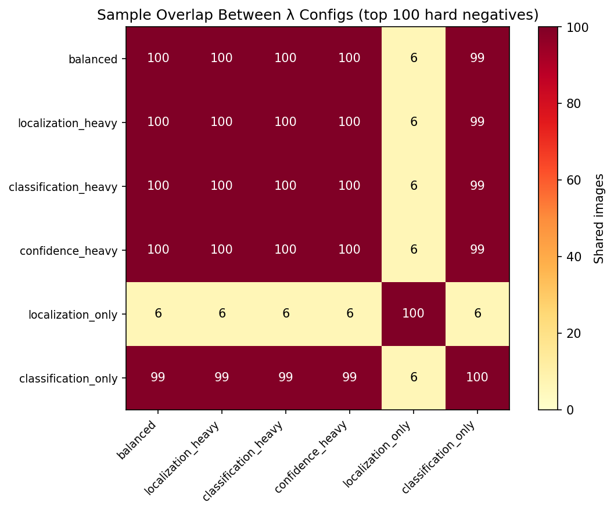
*Figure 10 (`analysis/figures/hnm_overlap_heatmap.png`): An overlap matrix showing how many hard negatives each pair of configs share. Five of six configs overlap perfectly.*

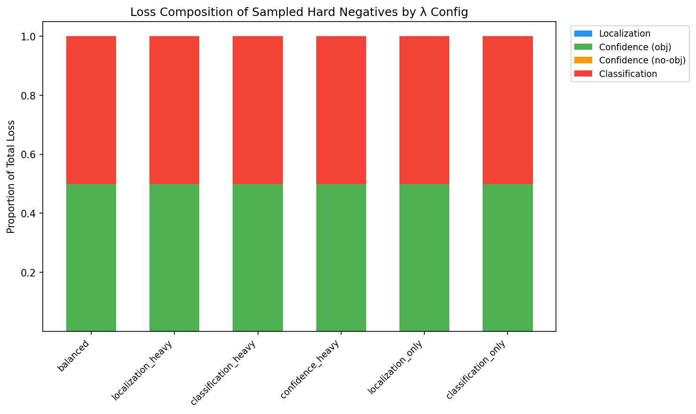
*Figure 11 (`analysis/figures/hnm_loss_composition.png`): Normalized loss breakdown per config, confirming that `conf_loss_obj` and `class_loss` dominate equally across the board.*

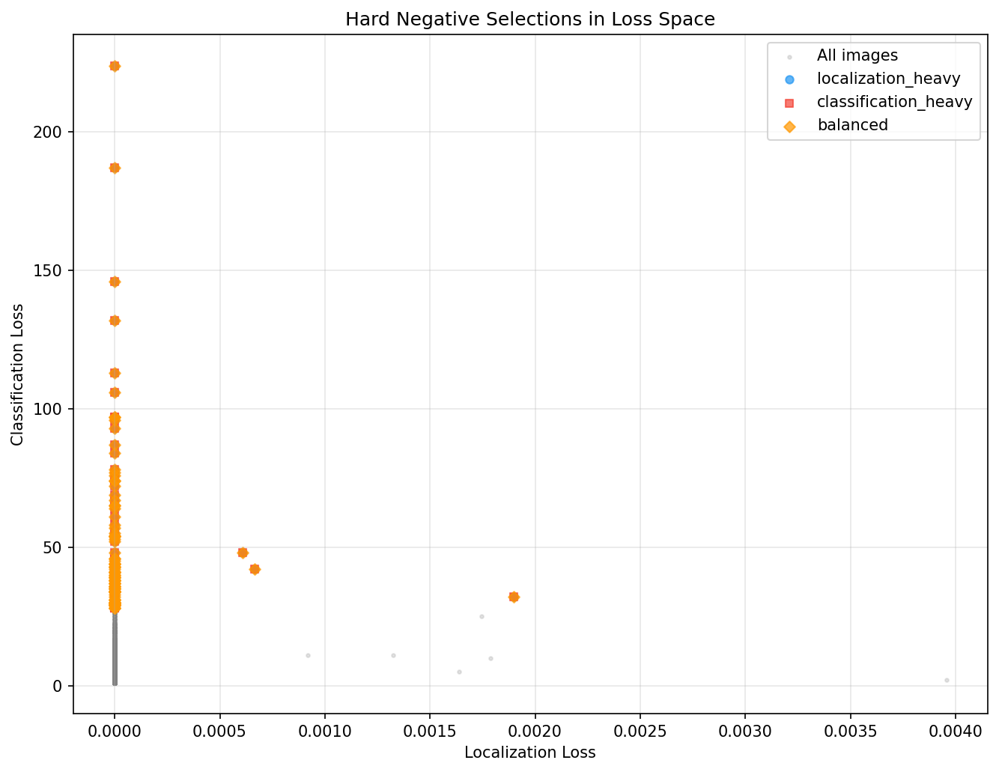
*Figure 12 (`analysis/figures/hnm_loss_scatter.png`): Hard negative selections plotted in localization-vs-classification loss space. Almost all points cluster near zero on the localization axis.*

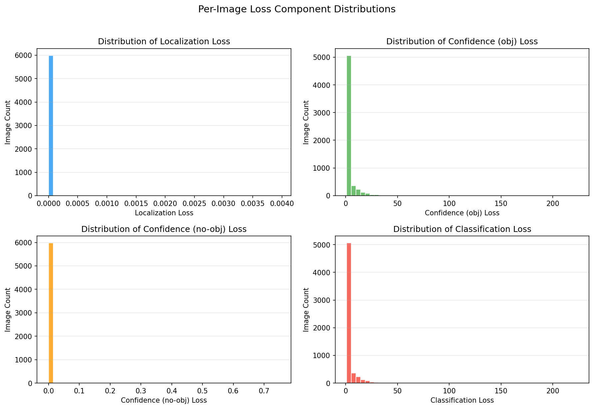
*Figure 13 (`analysis/figures/hnm_loss_distributions.png`): Per-image distribution of each loss component. Notice the heavy tail on `conf_loss_obj` and `class_loss`: most images have low loss, but a handful of dense scenes have very high loss (up to 224, corresponding to 224 unmatched objects).*

### Interpretation

The fact that five different lambda configurations converge on the same 100 images is the central takeaway here. Because `conf_loss_obj` and `class_loss` are perfectly correlated and orders of magnitude larger than the other two components, any configuration assigning nonzero weight to either term produces an identical ranking. Lambda tuning only becomes meaningful when the loss components actually have different distributions, and right now they do not.

The images that get selected as hard negatives (averaging around 52 unmatched ground truth objects each) are the densest scenes in the dataset: warehouse floors packed with boxes, pallets, people, and equipment. These are genuinely the hardest images for the model. More objects means more chances to miss something.

This finding ties directly back to everything we have seen in Tasks 1, 3, and 4. The dominant failure mode of this model is **low recall**. It is not that the model draws bad boxes or confuses classes; it is that it misses objects entirely, especially in crowded scenes. HNM confirms the same conclusion from the loss perspective.

### Design Implications

Right now, lambda tuning has **limited practical impact** on which images HNM selects. The simplest and most effective retraining strategy is to emphasize dense, multi-object scenes regardless of lambda settings.

Lambda tuning would become meaningful **after a round of retraining improves recall**. Once the model begins matching more ground truth objects, localization and classification losses will no longer collapse to the same signal. At that stage, tuning `lambda_coord` to target mislocalized boxes or `lambda_cls` to target misclassified objects would actually produce different hard negative samples. This naturally suggests a two-stage retraining strategy:
1. **Stage 1:** Retrain using current hard negatives to increase object coverage (recall).
2. **Stage 2:** Recompute HNM and apply targeted lambda tuning to refine specific error modes.

One alternative approach worth mentioning is to skip loss-based HNM entirely and instead mine hard negatives using the detection-level metrics from Task 1 (for example, selecting images with the lowest per-image F1 after running full inference and NMS). This approach would be more directly tied to deployment performance, though it is also more computationally expensive since it requires NMS as part of the mining loop.

---

## Conclusion

This analysis followed a connected sequence of design decisions for the TechTrack system:

1. **Model 2 was selected** over Model 1 because it delivers a strictly better result across all 20 classes, with the largest gains on safety-critical categories like forklift (+11.7 F1 points) and person (+7.4 points). The improvement is driven primarily by higher recall, which aligns directly with the system's safety-oriented objective.

2. **A reproducible 6,000-image sample** was constructed with verified class coverage to balance computational efficiency with statistical stability. This ensured that all downstream experiments operated on a consistent and representative foundation.

3. **An NMS threshold of 0.5** was chosen as the best balance of precision and recall, achieving F1 = 0.6194. It improves recall relative to the default 0.4 while avoiding the precision collapse observed beyond 0.6. This setting lies within the plateau region of the precision-recall curve and reflects a balanced deployment trade-off.

4. **Augmentation analysis** showed the model handles mild brightness changes well (plus or minus 25%) and tolerates light blur (k=3), but breaks down badly under heavy blur (F1 drops 31 points at k=21) and vertical flipping (F1 drops 31 points). This tells us which augmentations belong in training (mild blur and brightness) and which do not (vertical flip), and flags the environmental conditions where the system would need hardware-level fixes.

5. **HNM analysis** revealed that the model's primary failure mode, missed detections in dense scenes, causes all four loss components to collapse to the same signal. This makes lambda tuning ineffective today, but points toward a staged retraining approach where recall is improved first, and lambda-tuned HNM is used afterward to address finer-grained errors.

Across all five tasks, one conclusion remains consistent: recall, not precision, is the system's limiting factor. With recall hovering around 53% and precision near 82%, the model's core weakness is incomplete object coverage, especially in crowded warehouse scenes. For a safety-critical system, this makes retraining on dense hard negatives the highest-leverage intervention. Augmenting that retraining with mild blur and brightness variation will further strengthen robustness under realistic conditions. Only after recall improves will secondary tuning mechanisms, such as lambda-weighted HNM, adaptive NMS thresholds, and confidence calibration, become meaningful.

---